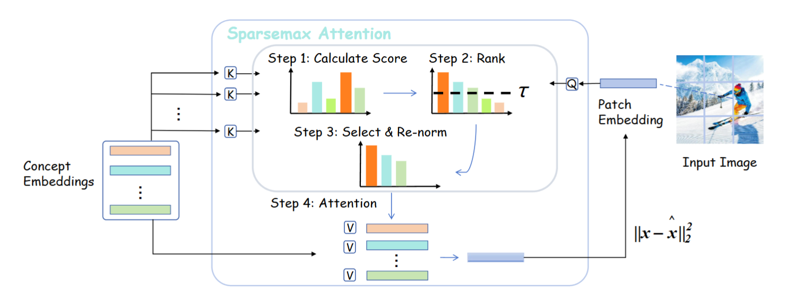
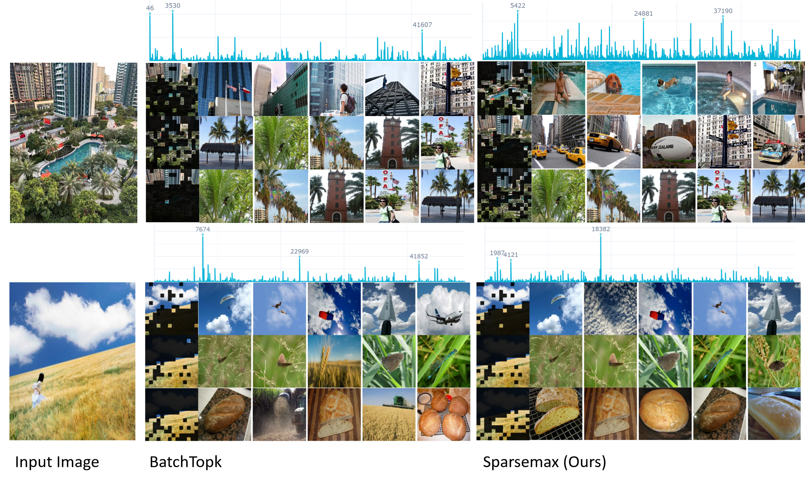
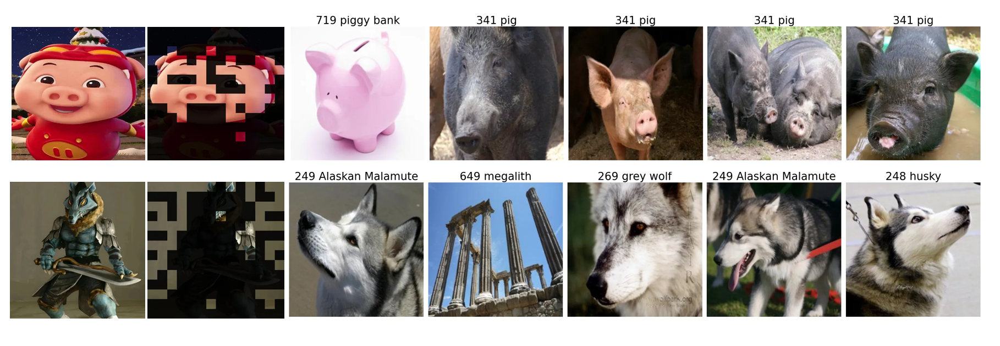

# Saprsemax SAE: Improving Sparse Autoencoder with Dynamic Attention

>This project introduces an SAE architecture powered by adaptive sparse attention, enabling cleaner and more scalable feature discovery in foundation models. By reframing the SAE as a cross-attention module and replacing fixed sparsity with sparsemax-based dynamic sparsity, the model automatically selects the right number of concepts per neuron. This yields lower reconstruction error, higher-quality features, and data-driven sparsity guidance that can improve existing SAE approaches.
## 🛠 Getting Started

Set up your environment with these simple steps:

```bash
# Create and activate environment
conda create --name patchsae python=3.12
conda activate patchsae

# Install dependencies
pip install -r requirements.txt
```
## train SAE
```bash
./01_run_train.sh
```
## evaluate SAE
```bash
# get class-leval data and top-k feature
./03_run_class_level.sh
# run classification with top-k feature
./04_run_topk_eval.sh
```
## viusalize SAE
```bash
./02_run_compute_feature_data.sh
PYTHONPATH=./ python src/demo/app.py
```






### License Notice

Our code is distributed under an MIT license, please see the [LICENSE](LICENSE) file for details.
The [NOTICE](NOTICE) file lists license for all third-party code included in this repository.
Please include the contents of the LICENSE and NOTICE files in all re-distributions of this code.

---


